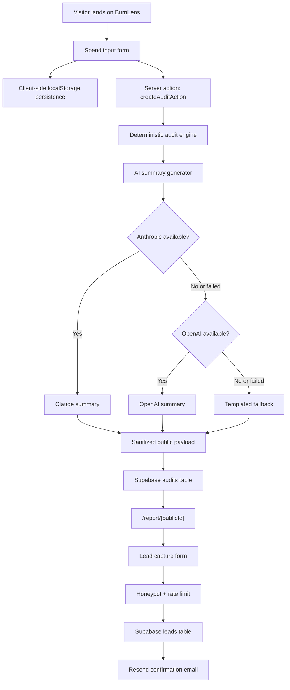

# Architecture

## System Diagram

## Data Flow

The user enters team size, primary use case, and tool-level spend. The form persists to `localStorage` so a refresh does not wipe the audit. On submit, the server action validates the payload with Zod and recomputes the audit on the server, preventing a client from tampering with savings numbers.

`auditStartupSpend` reads the typed pricing catalog and applies rules for single-user team plans, enterprise misuse, excess seats, over-retail spend, duplicate tools, and API routing/credit opportunities. The result is then summarized by Anthropic if configured, OpenAI if Anthropic fails, or a deterministic fallback paragraph if both providers are unavailable.

The shareable payload is sanitized before insertion. Supabase stores the raw audit result and the already-sanitized `public_payload`. The public route only reads the sanitized payload and builds Open Graph/Twitter metadata from team size, use case, and savings.

## Stack Choice

Next.js 15 App Router is the best fit because this product needs a polished landing page, server-rendered public reports, dynamic metadata, server actions, and Vercel deployment. TypeScript keeps the audit rules and tool catalog honest. Tailwind plus shadcn/ui gives a fast product-design system without using a dashboard template. Supabase is enough backend for MVP storage, and Resend is a reliable transactional email layer.

## Scaling to 10k Audits/Day

At 10k audits/day, I would move summary generation to a queue so the first result renders immediately with deterministic math and the AI paragraph streams in later. Supabase can handle the write volume, but I would add database indexes on `created_at`, `public_id`, and lead conversion fields, plus a daily rollup table for metrics. Rate limiting should move from in-memory buckets to Upstash Redis or Supabase Edge Functions. Pricing data should become a versioned table so every audit can cite the exact pricing snapshot used at generation time.
