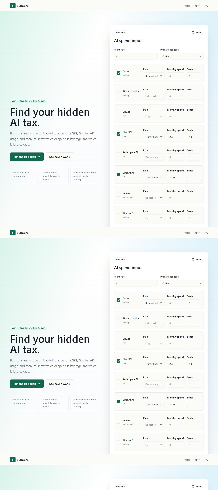
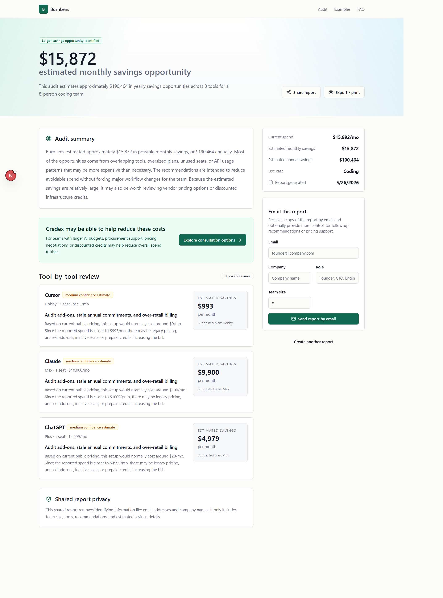
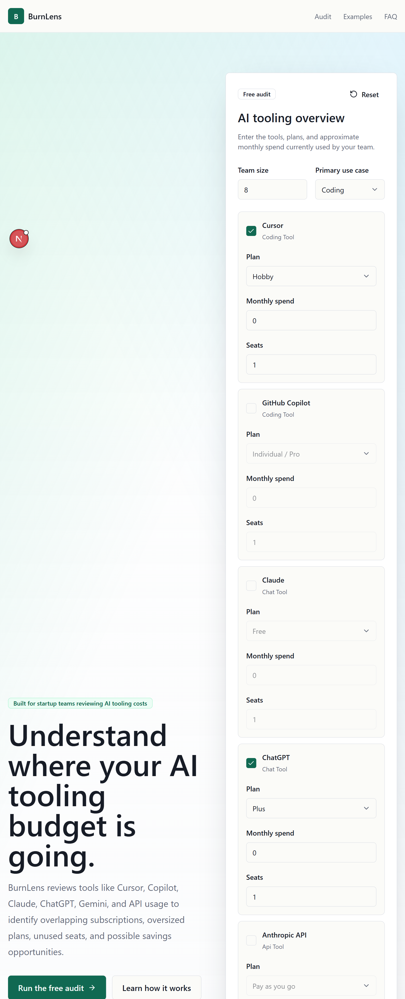

# BurnLens

BurnLens is a lightweight AI spend audit tool for startups. It helps founders, engineering teams, and operations leads review whether they may be overspending on tools like Cursor, Claude, ChatGPT, Copilot, Gemini, Windsurf, and direct API usage.

The product generates deterministic savings recommendations using pricing assumptions and usage patterns, then creates a short AI-generated summary to explain the results in a more readable way.

**Live URL:** https://burnlens-exhy.vercel.app/

---

## Screenshots

Add screenshots after final deployment under `public/screenshots/`:







---

## Quick Start

```bash
npm install
cp .env.example .env.local
npm run dev
```

Open:

```txt
http://localhost:3000
```

Enter a sample AI tooling stack and generate an audit report.

Without Supabase configured, the app falls back to a temporary local preview mode. With Supabase enabled, generated audits receive persistent public report URLs.

---

## Deploy

1. Create a Supabase project and run:

```txt
docs/supabase-schema.sql
```

2. Add variables from `.env.example` to Vercel

3. Configure Resend with a verified sending domain

4. Deploy using the standard Next.js Vercel setup

Run checks before deployment:

```bash
npm run lint
npm test
npm run build
```

---

## Technical Decisions

### 1. Next.js App Router instead of a separate backend

The project benefits from server actions, public routes, metadata generation, and simple Vercel deployment without requiring a detached API server.

### 2. Deterministic audit engine instead of AI-generated savings logic

Pricing recommendations should stay explainable and reproducible, so the audit calculations live inside `lib/audit/audit-engine.ts`. AI is only used for the short summary text.

### 3. Supabase for persistence and shareable reports

The product does not require authentication, but lead capture and public report URLs still need a lightweight backend and durable storage layer.

### 4. Sanitized public report payloads

Email addresses and company details are removed before generating public report objects to avoid exposing private information through shared URLs.

### 5. Low-friction abuse protection

Lead capture happens after users already receive value from the audit, so a lightweight honeypot and IP-window approach felt more appropriate than introducing CAPTCHA flows early in the MVP.

---

## Local Scripts

- `npm run dev` → start the development server
- `npm run lint` → run ESLint
- `npm test` → run audit engine tests with Vitest
- `npm run build` → verify production build

---

## Submission Notes

The repository includes:
- application code,
- CI configuration,
- pricing references,
- prompts,
- schema setup,
- and supporting business documentation for the assignment.

Before final submission, placeholder sections were replaced with:
- realistic devlog entries,
- interview notes,
- documentation revisions,
- and manual review passes across the recommendation logic and UX copy.
